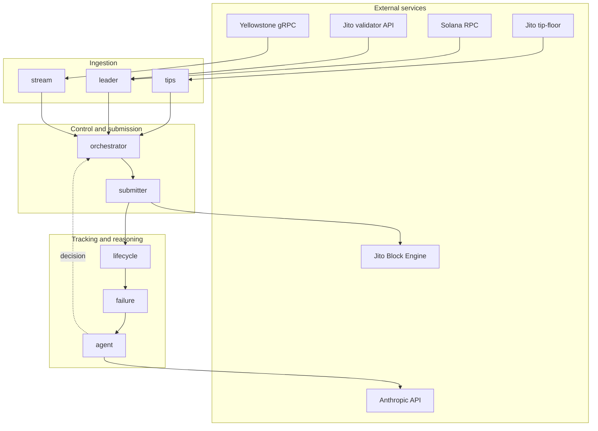

# Smart Transaction Stack — Architecture

A Rust service that submits Solana transactions through Jito bundles with the
discipline a production system needs: it watches the leader schedule over a
streaming connection, prices its tip from live auction data, tracks every
submission through its full commitment lifecycle, classifies failures from
real evidence, and lets an AI agent own one operational decision — what to do
when a bundle does not land.

This document explains how the system is built and why it is built that way.
It is organised around the eight crates that make up the workspace, the data
that flows between them, and the design decisions that survived contact with
mainnet.

---

## 1. What the system does

The job is narrow and unforgiving: get a transaction into a block, on time,
and know with certainty whether it landed.

On Solana that means more than signing a transaction and calling an RPC. A
transaction that is correct but late misses its slot. A bundle that is
well-formed but under-tipped loses its auction. A confirmation read from a
single RPC poll can lie by omission. The system is designed around these
failure modes rather than the happy path, because the happy path is the part
that takes care of itself.

Concretely, on every run the system:

1. Streams slot updates and transaction statuses from a Yellowstone gRPC
   endpoint, so it always knows the current slot and can see its own
   transactions land.
2. Computes which upcoming slots belong to Jito-enabled leaders, and fires a
   submission window one to two slots *ahead* of such a leader, so the bundle
   is buffered at the block engine before that leader begins producing.
3. Prices the tip from the live Jito tip-floor stream rather than a hardcoded
   constant.
4. Builds a bundle, submits it through an authenticated, rate-limited path to
   the block engine, and records the submission.
5. Tracks the submission through Submitted → Processed → Confirmed → Finalized,
   stamping the slot and timestamp at each transition and computing the latency
   deltas between them.
6. When a bundle does not reach a terminal state, classifies *why* from the
   evidence available, and hands that classification to an AI agent that
   decides whether to retry, reprice, refresh the blockhash, or give up.

---

## 2. System overview

The arrows are data, not control. The orchestrator owns the control loop; every
other crate is a focused capability it composes. The two crates that touch the
network most aggressively — `stream` and `submitter` — are the ones with the
most defensive engineering, because that is where reality intrudes.

---

## 3. The crates

The workspace is eight library crates plus a binary. Each has one
responsibility and a small surface area, so that a problem can be localised to
a single crate and tested there. What follows is what each does and the design
decision worth knowing about it.

### 3.1 `stream` — Yellowstone ingestion

Subscribes to a Yellowstone gRPC endpoint for two things: slot updates (the
clock) and transaction statuses (so the system can see its own bundles land).
It runs under a reconnect supervisor with backoff, and on every reconnect it
triggers a reconciliation pass so no landing is missed across a connection gap.

**Design decision — asymmetric backpressure.** Slot updates and transaction
statuses have different criticality. A dropped slot update is harmless; the next
one arrives in ~400ms. A dropped transaction status can mean missing the
confirmation of a bundle. So the two are handled differently: slot updates use a
droppable `try_send` (lossy is fine, freshness matters), while transaction
statuses use an `await`-ing `send` that applies backpressure (delivery
guaranteed, never silently dropped). One stream, two delivery contracts, matched
to what each piece of data is worth.

**Lesson learned — the empty-filter firehose.** An early version subscribed to
transaction statuses with an empty account filter, intending "watch my wallet."
An empty `account_include` filter does not mean "watch nothing" — it means
*match every transaction on mainnet*. The result was a firehose that stalled the
receive loop and drew a backpressure warning from the infrastructure provider.
The fix was to omit the transaction subscription entirely when there are no
pubkeys to monitor, rather than send an empty filter. Empty and absent are not
the same thing.

### 3.2 `leader` — leader schedule intersection

Answers one question: *when is the next slot produced by a Jito-enabled leader,
and is it soon enough to submit to?* It fetches the leader schedule from RPC and
intersects it with the set of Jito validators fetched from Jito's validator API,
matching on the validator's **identity account** (not its vote account — a
distinction that matters, since the schedule is keyed by identity).

**Design decision — submit ahead of the leader, by leader group.** Solana
assigns leaders in groups of four consecutive slots. Because Jito validators
hold the large majority of stake, the *current* slot is almost always already
Jito-led, which tempts a naive implementation into submitting to a leader that
is already mid-block. That bundle arrives late and loses. Instead, the leader
crate computes the start of the *next* leader group strictly ahead of the
current slot (`current - (current % 4) + 4`, stepping forward to the first
Jito-led group) and the window fires only when the target is one to two slots
ahead. The bundle is buffered at the block engine before that leader begins
producing. (See §5, the latency investigation, for why this matters so much.)

**BAM awareness.** The validator set carries a `running_bam` flag. The crate
surfaces an `is_bam` bit on each leader window, so the orchestrator knows
whether the upcoming leader runs the BAM Node auction in addition to the Block
Engine auction — which changes how a bundle should be priced (see §3.4 and §6).

### 3.3 `tips` — live tip pricing

Connects to Jito's tip-floor websocket (with a REST fallback) and converts the
live stream of tip percentiles into a number of lamports. It is deliberately a
*feed*, not a *policy*: it reports what the market is doing (p50, p75, p95) and
leaves the choice of which percentile to pay to the orchestrator. No tip value
is ever hardcoded; the tip a bundle pays is always derived from live data, and
the percentile is configurable.

### 3.4 `submitter` — bundle construction and submission

Builds the bundle, signs it, and submits it to the block engine. The bundle is
two transactions:

1. A memo instruction (an on-chain marker the system filters on to recognise its
   own transaction) plus a self-transfer, optionally preceded by compute-budget
   instructions (see below).
2. A tip transfer to a Jito tip account — the last transaction in the bundle, as
   Jito requires.

**Design decision — the hot path makes one network call.** Everything a
submission needs except the send itself is pre-fetched in the background: a
blockhash cache refreshes every two seconds (a blockhash is valid for ~150
slots, so a two-second-old one has ample runway), and the tip accounts are
warmed on startup and refreshed periodically. At submission time the build reads
both from memory and the only network call is `sendBundle` itself. This took the
in-window latency from over 1.5 seconds down to ~200ms — the difference between
landing in the target slot and missing it. (See §5.)

**Design decision — one authenticated, rate-limited choke point.** Every call to
the block engine — `getTipAccounts`, `sendBundle`, and the two status queries —
routes through a single function that (a) acquires a token from a shared rate
limiter before sending and (b) attaches the `x-jito-auth` header when a UUID is
configured. `sendBundle` is given priority in the limiter so background traffic
(the tip warmer, the status poller) can never starve a live submission. This
design came directly out of a production incident (see §5, the rate-limit
self-collision).

**BAM-aware pricing (gated).** When the target leader is a BAM validator, the
submitter can attach a compute-budget priority fee, pinned to an explicit
compute-unit limit so the fee is predictable and the auction denominator is
tight. This exists because the two Jito auctions score bundles differently (see
§6); it is off by default and tuned against live data.

### 3.5 `lifecycle` — the commitment state machine

Owns the truth about where every bundle is. It persists submissions to SQLite
and advances them through Submitted → Processed → Confirmed → Finalized,
stamping the slot and wall-clock timestamp at each transition and recording the
latency deltas between them. It is driven by the transaction-status stream from
`stream`, with a reconcile hook that runs on reconnect to catch anything that
landed during a gap. A timeout sweeper moves bundles that never land to a
terminal `NeverLanded`/`Failed` state after a bounded window, so nothing sits
frozen at Submitted forever.

**Why stream-based confirmation, not RPC polling.** A single RPC poll sees only
the state at the moment it is asked, and a bundle can land and be missed between
polls. The transaction-status stream delivers every status transition as it
happens, which is both lower-latency and more complete. RPC polling is used only
for reconciliation after a gap, never as the primary signal.

### 3.6 `failure` — evidence-based classification

A pure classifier: given the evidence collected about a failed submission, it
returns a `FailureKind` (expired blockhash, fee too low, compute exceeded,
transport error, bundle failure, **auction lost**) with a confidence level and a
rationale. It holds no state and makes no network calls, which makes it
exhaustively testable.

**Design decision — classify from evidence, name the root cause, not the
symptom.** A bundle that never landed and whose blockhash has since aged past 150
slots *looks* like an expired-blockhash failure — but the blockhash only aged
*because the bundle sat unlanded after losing its auction*. The expiry is a
downstream symptom, not the cause. The classifier therefore reserves
`ExpiredBlockhash` for a blockhash that was already stale *at submission*, and
otherwise reaches for `AuctionLost`: with a `Certain` verdict when Jito's
`getInflightBundleStatuses` (persisted by the bundle-status poller into the
`jito_inflight_status` column) returned `Invalid`/`Failed`, and an `Ambiguous`
one — naming `BundleFailure` as the alternative — when auction loss is only
inferred from a valid-at-submission blockhash and a competitive tip. A sub-market
tip is still called `FeeTooLow` (the actionable root cause). Transport-level
errors — including the block engine's rate-limit response — are checked first, so
they are never misread as a tip or construction problem.

### 3.7 `agent` — the operational decision

The AI agent owns exactly one real operational decision: **given a classified
failure, what should the system do about it?** Retry as-is, raise the tip,
refresh the blockhash and retry, or abort. This is the decision where a language
model earns its place — not as a wrapper around a lookup table, but because the
ambiguous cases (a never-landed bundle with a competitive tip and an aged
blockhash) are exactly where a rigid rule misfires and reasoning over the full
context does better.

**Design decision — a shadow baseline and a guardrail.** Every agent decision
runs alongside a deterministic baseline agent in an A/B shadow, and both
decisions are persisted, so the LLM's choices can be compared against a simple
rule after the fact. The agent's proposed actions pass through a clamp that
bounds them to safe ranges (a tip can be raised, but not without limit). If the
LLM call fails, the system falls back to the deterministic baseline rather than
stalling. The model reasons; it does not get unchecked control.

### 3.8 `orchestrator` — the control loop

The binary. It composes the other crates into a run loop: warm up until the slot
clock, leader schedule, and Jito set are ready; wait for a leader window;
compute the tip; submit; track the lifecycle; and on a terminal failure, invoke
the agent and act on its decision. It also drains every submission to a terminal
state before exiting, so a run produces a complete, honest record rather than
leaving bundles in flight. Run modes cover normal submission, fault injection
(for deliberately producing classified failures), log export, and status
inspection.

---

## 4. Data flow on a single submission

Putting the crates together, here is one normal submission end to end.

1. **Warmup.** `stream` connects and begins delivering slots; `leader` fetches
   the schedule and the Jito set; `tips` connects to the tip stream; the
   blockhash and tip-account caches fill. The orchestrator waits until the slot
   clock, schedule, and Jito set are all live.
2. **Window.** `leader` reports that a Jito leader's slot group begins one to two
   slots ahead, and whether that leader is BAM.
3. **Price.** The orchestrator reads the configured percentile from `tips` and
   sets the tip. On a BAM leader, with BAM pricing enabled, it also sets a
   priority fee and compute-unit limit.
4. **Build and send.** `submitter` reads the cached blockhash and a tip account
   from memory, builds and signs the two-transaction bundle, and sends it
   through the single authenticated, rate-limited choke point. The only network
   call is `sendBundle`.
5. **Track.** The returned bundle id and the memo signature are recorded;
   `lifecycle` begins watching the transaction-status stream for the memo
   signature.
6. **Resolve.** Either the memo signature appears in the stream and `lifecycle`
   advances the bundle through its commitment states (recording the deltas), or
   the timeout sweeper moves it to a terminal never-landed state.
7. **On failure.** `failure` classifies the terminal failure from the collected
   evidence; `agent` decides the response; the orchestrator acts on it (retry,
   reprice, refresh, or abort), bounded by `max_attempts`.
8. **Drain.** The orchestrator waits for every bundle from the run to reach a
   terminal state before shutting down.

---

## 5. The latency investigation

The single most instructive part of building this system was discovering *why*,
for a long time, no bundle would land — and the answer was never where it
seemed. The investigation eliminated eight hypotheses, each by direct
measurement rather than guesswork, and each elimination is a design lesson baked
into the crates above.

The method throughout: when a bundle did not land, do not theorise about why —
measure something that distinguishes the candidate causes. Capture the raw
response. Decode the actual bytes on the wire. Simulate the exact signed
transaction. Query the source of truth directly. Reasoning from absence ("it
isn't on chain, so…") was repeatedly the thing that misled; reasoning from a
captured measurement was repeatedly the thing that resolved.

The hypotheses, and how each was settled:

1. **Bundle construction.** Decoded the exact base64+bincode bytes leaving the
   submitter. The bundle was structurally perfect: correct tip transfer, valid
   tip account, shared blockhash, tip last. *Ruled out by on-wire decode.*
2. **Execution / simulation.** Ran `simulateTransaction` on each transaction
   with signature verification on and blockhash replacement off — the faithful
   bytes. Both transactions executed cleanly. *Ruled out by simulation.*
3. **Wallet funding.** Checked the on-chain balance directly. Funded. *Ruled
   out.*
4. **Tip account / tip competitiveness.** Tried tips from p75 up to six times
   the p95 of the live floor, to a verified tip account. Still no land. *Ruled
   out by measurement.*
5. **Submission timing.** Instrumented the path and found ~870ms per RPC round
   trip; the bundle was arriving three to four slots after the target leader's
   slot had passed. This produced two fixes — submit ahead of the leader (§3.2)
   and move every RPC call out of the hot path (§3.4).
6. **TLS handshake.** Even after caching, the send itself cost ~740ms. A
   connect-versus-transfer probe showed ~2948ms of that was a fresh TLS
   handshake being paid on *every* call, against a ~196ms physical floor to the
   region. Connection pooling and pre-warming collapsed the hot-path send to
   ~200ms. This is why the submitter holds one warm, pooled connection.
7. **Rate limiting.** With timing fixed, bundles still vanished. Capturing the
   raw `sendBundle` response revealed an HTTP 429: *"Network congested. Endpoint
   is globally rate limited."* The system's own background traffic — tip warmer,
   status poller, and send — was colliding on the anonymous one-request-per-
   second budget. This produced the shared rate limiter with send priority
   (§3.4).
8. **Region routing.** Testing the global block-engine endpoint against the
   regional one ruled region routing in or out: identical results on both.
   *Ruled out.*

What remained after all eight was a clean HTTP 200 with a real bundle id,
followed by the block engine's own status API reporting the bundle as `Invalid`
within a second — every time. The resolution came from Jito support directly: a
returned bundle id only means the bundle was *received*; `Invalid` from the
status API means it did not win its auction and the record was discarded. The
operative facts: anonymous (unauthenticated) bundles rarely win in current
conditions, and the auctions are scored on tip-and-fee efficiency, not on a
bundle merely existing. That sent the design in two directions: authenticate
every submission with a JSON-RPC UUID, and price for the specific auction the
target leader runs (§6).

The value of this investigation is not that it ended in a single fix. It is that
the system is now instrumented to tell the truth about its own behaviour —
timing telemetry, raw response capture, on-wire bundle decoding, direct status
queries — so that the next surprise is a measurement away, not a guess away.

---

## 6. The two auctions

A Jito-enabled validator may run one or two auctions, and they score bundles
differently:

- **Block Engine auction** (every Jito validator): priority is approximately
  **tips / compute-units**.
- **BAM Node auction** (BAM validators only): priority is approximately
  **(tips + priority fees) / compute-units**.

This has a direct design consequence. On a plain Block Engine leader, only the
tip matters, and a tight compute footprint helps. On a BAM leader, priority fees
count too — so a tip-only bundle competes with half the formula missing. The
system surfaces `is_bam` per leader (§3.2) and, when BAM pricing is enabled,
attaches a priority fee *paired with an explicit compute-unit limit*. The pairing
matters: the fee is `price × requested-CU-limit`, and without an explicit limit
the default request inflates the denominator several-fold, both making the fee
unpredictable and collapsing the (tips+fees)/CU ratio that the auction actually
scores. Pinning the limit keeps the denominator tight and the fee deliberate.

---

## 7. Design principles, in summary

The recurring ideas behind the specific decisions:

- **Match the delivery contract to the value of the data.** Lossy where
  freshness wins (slots), guaranteed where completeness wins (tx status).
- **Keep the hot path free of network calls.** Everything a submission needs is
  pre-fetched; the only in-window call is the send.
- **Submit ahead of the leader, not at it.** Buffer the bundle before the slot
  begins.
- **One choke point for the block engine.** Authentication and rate limiting
  live in a single function, with live submissions prioritised over background
  traffic.
- **Classify from evidence, and admit ambiguity.** Weigh competing causes; do
  not return false confidence.
- **Let the model reason, but bound it.** A shadow baseline, a guardrail clamp,
  and a deterministic fallback keep the AI decision safe and auditable.
- **Measure, do not guess.** Every hard problem in this build was solved by
  capturing a real measurement that distinguished the candidate causes.
